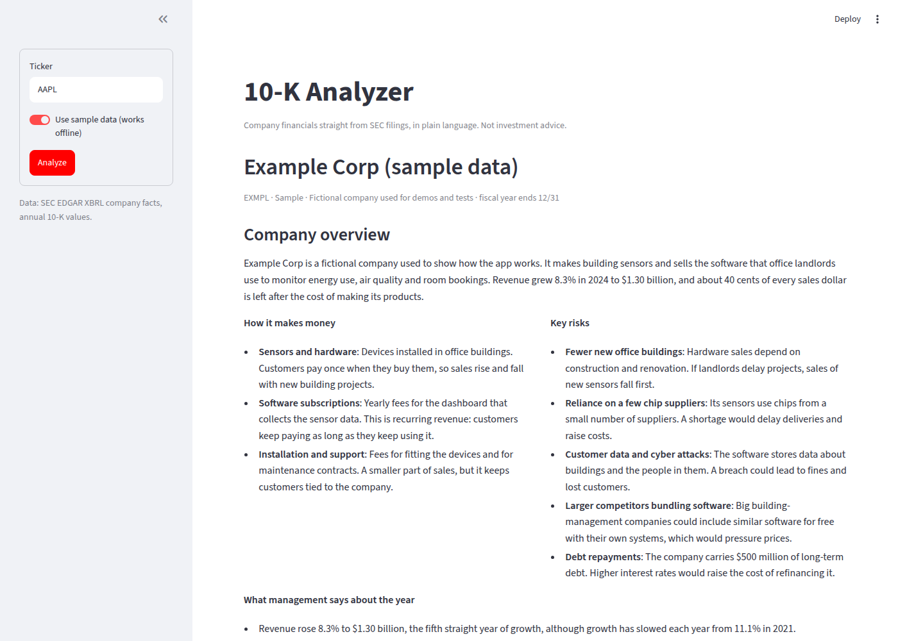

# 10-K Analyzer


Type a US ticker and get a plain-English company overview, a downloadable three-statement
Excel model with key margins highlighted, recent news scored for mood, and an AI research
agent that answers questions about the company using the filings themselves.

All data comes from free sources: SEC EDGAR for filings and XBRL financials, RSS feeds for news.

> Work in progress. Not investment advice.


## Status

- [x] Project setup, CI, SEC EDGAR client with caching
- [x] Three-statement model and key ratios from XBRL company facts
- [x] Excel export with live ratio formulas and highlighting
- [x] Streamlit app: profile, headline numbers, statements, ratios, Excel download
- [x] Company overview written by Claude from the 10-K
- [ ] News and sentiment (FinBERT + LLM mood tags)
- [ ] "Ask the analyst" agent with step trace and eval set

## Run locally

```bash
python -m venv .venv && source .venv/bin/activate
pip install -e ".[dev]"
export SEC_USER_AGENT="10-K Analyzer you@example.com"   # SEC requires a contact email
pytest
```

```python
from tenk.sources.edgar import EdgarClient

edgar = EdgarClient()  # reads SEC_USER_AGENT from the environment
print(edgar.profile("AAPL"))
print(edgar.latest_10k("AAPL").url)

from tenk.financials.statements import build_statements
from tenk.financials.ratios import compute_ratios

statements = build_statements(edgar.company_facts(edgar.ticker_to_cik("AAPL")), years=5)
print(statements.income)  # rows = line items, columns = fiscal year end dates
print(compute_ratios(statements))  # margins, growth, ROE, current ratio, debt to equity

from tenk.export.excel import write_workbook

write_workbook(statements, "AAPL.xlsx")
```

The workbook has a Summary sheet, the three statements in USD millions, a Ratios sheet
built from live Excel formulas (green when a ratio improves on the prior year, red when it
gets worse), a balance sheet check row, and a Sources sheet with the XBRL tag behind every
number.

Companies tag the same line item differently in XBRL, and many changed tags over time.
`src/tenk/financials/xbrl_map.py` lists fallback tags per line item; for each year the
first tag with a value wins, and `statements.sources` records which tag was used.
Missing subtotals such as gross profit are derived, restated values replace the originals,
and only full-year values from 10-K filings are used.

## Run the app

```bash
export SEC_USER_AGENT="10-K Analyzer you@example.com"
streamlit run app/streamlit_app.py
```

Turn on "Use sample data" in the sidebar to try the app without network access; it loads
a fictional company (`src/tenk/demo.py`) through the same code path as real filings.

### AI company overview



With `ANTHROPIC_API_KEY` set, a "Write the overview from the 10-K" button appears. The app
downloads the latest 10-K, pulls out Item 1 (Business), Item 1A (Risk Factors) and Item 7
(MD&A), and asks Claude for a plain-English overview: what the company does, how it makes
money, the five risks that matter most, and management's view of the year.

- Structured outputs make Claude's reply match a JSON schema, so nothing is parsed from free text.
- Server-side fallback (`fallbacks="default"`) retries a declined request on another
  model inside the same API call.
- Each overview is cached per filing, so a company costs one request per 10-K.
- `python scripts/record_demo.py AAPL MSFT` saves overviews into `src/tenk/demo_cache/`;
  the app shows saved overviews without an API key, so a public demo costs nothing to run.

### Deploy on Streamlit Community Cloud

1. At [share.streamlit.io](https://share.streamlit.io), choose "Create app" and pick this
   repository, branch `main`, main file `app/streamlit_app.py`.
2. Under Advanced settings, add the secret `SEC_USER_AGENT = "10-K Analyzer you@example.com"`.
   Add `ANTHROPIC_API_KEY` too only if visitors should be able to generate new overviews.
3. Deploy. `requirements.txt` installs this package and its dependencies.

## Project layout

```
src/tenk/
  cache.py         SQLite cache for API responses
  sources/edgar.py SEC EDGAR client (ticker lookup, filings, XBRL company facts)
  sources/filing_text.py  10-K HTML to text; Business, Risk Factors, MD&A sections
  nlp/summarize.py Claude overview: prompt, JSON schema, fallback handling
  demo_cache/      saved overviews shown without an API key
  financials/      XBRL tag map, three statements, ratios
  export/excel.py  three-statement Excel workbook
  service.py       loads everything the app shows for one company
  demo.py          fictional sample company (offline mode and tests)
app/
  streamlit_app.py web interface
scripts/
  record_demo.py   saves AI overviews for the demo
tests/             offline tests against recorded EDGAR responses
```
